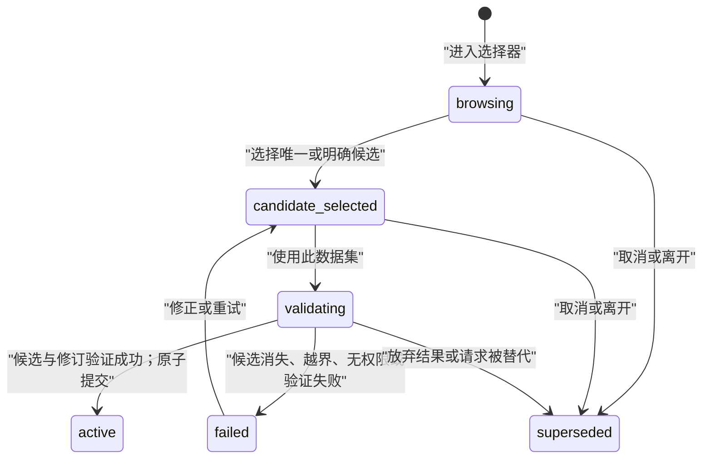

# Dash UI 系统规范：数据集上下文与通用交互

状态：已接受

日期：2026-08-03

本文档定义 ReacNet Scope Dash Web 的跨页面 UI 规则，并以“选择 Dataset Candidate → 使用此数据集 → 返回分析页”为首个完整参考流程。它是产品规范，不是对当前实现状态的声明；代码是否符合本文档，需要通过本文定义的功能、无障碍和视觉验收。

领域术语以根目录 [`CONTEXT.md`](../CONTEXT.md) 为准，事务化数据集切换的架构理由见 [`ADR-0010`](adr/0010-treat-dataset-switches-as-transactional-context-changes.md)，产品能力边界见 [`软件设计基准`](software-design-baseline.md)。早期日期化设计稿只作为历史资料；与本文冲突时，以本文为准。

数据集选择工作区采用已经用户确认的“Variant A — transactional workbench”；Variant B 与 Variant C 已被拒绝。原型只提供设计证据，不作为生产实现来源；决策、备选比较和截图矩阵见 [`数据集选择 UI 原型决策记录`](prototypes/dataset-selection-ui/decision-record.md)。

## 1. 目标与范围

本规范解决的不是单个按钮的样式，而是 Dash 页面共同遵守的操作层级、状态模型、反馈协议、无障碍基线和视觉验收方法。

本轮包括：

- 建立全部 Dash 页面的通用页面骨架与交互规则；
- 完整定义数据集选择、验证、提交、失败恢复、会话恢复和源修订变化；
- 审查当前实现与目标规则的偏差；
- 给出可自动化的功能、视觉和无障碍验收矩阵；
- 把数据集流程作为其他页面迁移时的参考实现。

本轮不包括：

- 逐页重画或实现全部 Dash 页面；
- 客户端文件上传、多用户权限或全局项目数据库；
- 把索引准备隐藏在数据集切换中；
- 手机专属交互或触控手势优化；
- 深色模式；
- 修改 ReacNetGenerator 源工件。

## 2. 现状审查

当前实现已经具备两个正确边界：`dataset-browser-candidate` 与 `app-store` 分离，且只有显式提交回调会替换当前数据集；数据集发现也只检查有限元数据，不读取大型源文件。这些边界必须保留。

仍需修正的系统性偏差如下：

| 区域 | 当前表现 | 风险 | 目标规则 |
| --- | --- | --- | --- |
| 导航 | 从分析页进入数据管理后不记录来源；提交成功只切回数据概览 | 用户丢失分析意图 | 成功后按入口返回；直接进入数据管理时留在原处 |
| 候选语义 | 用按钮与 `○/●` 模拟单选 | 选中状态不能被可靠感知，键盘模型不明确 | 使用原生单选或完整 radio-group 语义 |
| 候选摘要 | 显示“文件完整度 2/6”并按工件数、时间排序 | 暗示数据集存在单一完整状态，与 Analysis Capability 模型冲突 | 分能力显示状态，候选按名称稳定排序 |
| 全局进度 | 使用“正在读取或处理数据”的无对象提示 | 用户不知道哪个数据集、能力或阶段正在运行 | 前台反馈就近；后台任务显示数据集、能力和真实阶段 |
| 状态存储 | `app-store` 同时混合当前数据集、工件、能力和页面选择 | 切换时容易产生旧结果与新上下文组合 | 使用正交状态轴和显式迁移 |
| 能力阻断 | 页面状态条、禁用按钮和空状态各自实现 | 同一种缺项在不同页面有不同解释和出口 | 导航始终可达，只阻断依赖缺失能力的执行动作 |
| 反馈 | 多个页面拥有独立 Alert 容器和措辞 | 成功、失败、进度与跨页影响缺少统一层级 | 使用字段、区域、全局通知和会话状态四级协议 |
| 路径浏览 | 手动绝对路径输入占据主流程，缺少可见面包屑 | 新用户必须理解服务器路径，远程部署暴露多余结构 | 最近记录、允许根和面包屑优先；绝对路径为专家入口 |
| 视觉语义 | 小字号、小按钮、直接颜色值与 Unicode 图标并存 | 层级不稳定，无障碍和视觉回归难以验收 | 统一密度、语义令牌、离线 SVG 图标和状态矩阵 |
| 规模 | 一次渲染全部子目录，无上限或截断反馈 | 大目录可能阻塞浏览器并静默丢失可见性 | 筛选、分段/虚拟化、总数与显示数 |
| 测试 | 以 Python 回调与布局烟雾测试为主 | 无法验证真实焦点、重排、浏览器语义和视觉退化 | 增加浏览器级关键流程、无障碍与固定截图验收 |

审查证据入口：

- [`scripts/webapp_dash/app.py`](../scripts/webapp_dash/app.py)：全局进度、数据管理页面、按钮和会话 Store；
- [`scripts/webapp_dash/callbacks.py`](../scripts/webapp_dash/callbacks.py)：导航、目录浏览状态机、Current Dataset 原子写入和页面重置；
- [`scripts/webapp_dash/assets/app.css`](../scripts/webapp_dash/assets/app.css)：现有密度、焦点、响应式与数据管理样式；
- [`tests/test_dash_smoke.py`](../tests/test_dash_smoke.py) 与 [`tests/test_directory_browser.py`](../tests/test_directory_browser.py)：当前布局、回调和服务层覆盖边界。

## 3. 不可破坏的交互原则

1. 检查或选择 Dataset Candidate 不改变 Current Dataset。
2. 只有用户显式执行“使用此数据集”，且候选通过最新修订验证后，才提交新的 Current Dataset。
3. 验证期间旧 Current Dataset 继续有效；失败、取消、离开或过期响应不能修改它。
4. 数据集切换清除旧修订绑定的结果与选择，但保留仍具有相同含义的用户输入；系统不自动重新查询。
5. “使用此数据集”只做轻量发现、状态验证和上下文提交，不启动 Preparation Task。
6. Analysis Capability 独立可用；UI 不以单一“完整”“全部就绪”或工件计数概括整个数据集。
7. 页面导航始终可达；能力状态只阻断真正依赖该能力的执行动作。
8. Current Dataset、页面与查询状态按浏览器标签页隔离；Preparation Task 按数据集和源修订归属并可跨页面、跨标签页观察。
9. 后台任务完成不得自动切换数据集、跳页或抢夺焦点。
10. 任何自动状态变化都必须保留稳定身份并能解释“发生了什么、影响什么、下一步是什么”。

## 4. 跨页面操作层级

所有数据依赖页面使用同一五层骨架：

1. **全局层**：Current Dataset 与后台任务摘要。
2. **页面层**：页面目的、所需 Analysis Capability 和当前可执行性。
3. **操作层**：输入、就近校验、唯一主行动和当前前台进度。
4. **结果层**：结果摘要、表格或可视化，以及空、错、截断和修订失效状态。
5. **后续层**：用稳定身份把结果交接给下一个工具的上下文操作。

复杂页面可以在操作层内增加步骤，但不能复制全局状态、把结果误作输入，或把跨工具交接包装成隐含导航。对数据集选择器而言，Dataset Candidate 的 Analysis Capability 审查属于结果层，Current Dataset 与 Dataset Candidate 的切换影响审查和提交属于后续层；五层是语义分区，不要求渲染为五张等权卡片。桌面工作台同时保持浏览、分能力证据和切换审查三个决策区可见；窄屏按同一 DOM 顺序重排为浏览 → 证据 → 提交。

### 4.1 行动优先级

- 每个页面或当前步骤最多一个高强调主行动。
- 主行动使用品牌强调色；绿色表示成功，不作为普通主操作色。
- 次要操作使用低强调或描边样式；返回、取消使用次要或文字样式。
- 红色只用于清理等破坏性动作，并限制在危险区或确认流程中。
- 禁用状态不是解释。只要用户可能不知道原因，就必须在控件附近提供原因和可行出口。
- 忙碌按钮原位显示真实动作，例如“正在验证…”，并保持尺寸稳定。
- 模态框只用于不可逆或高代价确认；普通输入、错误和能力缺失不使用模态框。

### 4.2 页面能力阻断

当页面所需能力不可用时：

- 页面和输入仍可访问、可编辑；
- 已属于旧修订的结果不显示为当前结果；
- 只禁用依赖缺失能力的执行动作；
- 操作区显示缺失能力、原因、影响和一个主出口；
- 主出口跳到“管理数据”并高亮对应能力，由用户在那里显式启动 Preparation Task；
- 数据管理保留来源页，提供返回入口。

没有 Current Dataset 时使用统一阻断空状态，主行动为“选择数据集”。

## 5. 正交状态模型

不得使用一个 `ready_count`、一个布尔 `loaded` 或一个泛化进度覆盖全部状态。至少保持下列状态轴独立：

| 状态轴 | 合法状态 | 说明 |
| --- | --- | --- |
| Dataset Selection | `idle`、`browsing`、`candidate-selected`、`validating`、`failed`、`superseded` | 标签页内的选择草稿；不等于当前上下文 |
| Current Dataset Context | `none`、`restoring`、`active`、`revision-changed`、`unavailable` | `active` 必须携带 `dataset_id` 与源修订 |
| Analysis Capability | `missing-source`、`needs-preparation`、`preparing`、`ready`、`stale`、`invalid` | 每项能力独立判断；不汇总成全局完整度 |
| Operation | `queued`、`running`、`succeeded`、`failed`、`cancelled`、`superseded` | 携带操作对象、阶段、请求身份与必要进度 |

`succeeded` 是可记录和播报的结果，不应成为让按钮永久停留在“成功”的页面模式。`superseded` 表示用户已经离开、取消或发起了更新请求，旧结果即使晚到也不得提交。

### 5.1 数据集切换状态迁移

图中的 `active` 表示提交了新的 Current Dataset；在此之前，旧 Current Dataset 若存在，始终保持 `active`。选择流程的 `failed` 不把旧上下文改为失败。

### 5.2 数据集切换后的页面状态

切换成功后：

- 清除旧数据集或旧修订绑定的表格结果、选中行、Reaction Occurrence、Candidate Path、Event Path、轨迹、步骤进度和交接上下文；
- 保留具有相同领域语义的 SMILES、分子式、筛选阈值和显示偏好；
- 将保留输入标记为“尚未在当前数据集运行”；
- 不自动执行查询或启动索引；
- 从分析页发起时返回来源页；从侧栏主动进入数据管理时留在数据管理。

### 5.3 源修订变化

检测到当前源工件变化时：

- Current Dataset 身份保留，状态进入 `revision-changed`；
- 旧修订结果和选择立即停止作为当前证据使用；
- 输入保留；受影响能力与索引显示为 `stale` 或 `invalid`；
- 用户执行“更新当前数据集状态”后，系统重新验证并采用新修订；
- 不把该流程描述成切换数据集。

路径失效、权限撤销或数据集身份无法重新验证时进入 `unavailable`。系统不得静默选择同目录中的其他候选。

### 5.4 会话与标签页

- 会话恢复先进入 `restoring`，重新验证路径权限、`dataset_id` 和源修订后才能启用执行动作。
- 恢复失败时清除 Current Dataset，但保留查询输入与最近记录。
- Current Dataset、页面和查询状态按标签页隔离，不通过本地存储广播切换。
- 最近记录可以在同一浏览器中共享。
- Preparation Task 属于 Dataset Workspace；不同标签页观察相同任务事实，但不会因此共享 Current Dataset。

## 6. 数据集选择参考流程

### 6.1 入口与退出

- 分析页的“选择数据集”或“切换数据集”进入数据工作区的专用选择页面，并记录来源页与触发器。
- 侧栏“管理数据”直接进入数据概览，不创建虚假的返回来源。
- 选择器是完整页面/子视图，不使用模态框或侧边抽屉。
- 取消选择流程返回来源页，并把焦点恢复到原触发器；旧 Current Dataset 不变。

### 6.2 浏览层级

主流程按以下顺序提供：

1. 最近数据集；
2. 允许根目录；
3. 根目录内的相对面包屑；
4. 当前目录的 Dataset Candidate；
5. 子目录列表。

手动粘贴服务器目录或公共前缀属于“输入服务器路径”专家入口。只有 Enter 或明确点击“前往”才触发导航；失焦不改变上下文。无效输入、越界、无权限和目录消失只在路径区域报告，不覆盖当前浏览位置、候选或 Current Dataset。

主界面默认显示允许根名称和相对面包屑。完整绝对路径只出现在专家输入、复制操作和展开详情中。错误不得泄漏堆栈、未授权根或无关内部路径。

### 6.3 候选发现与选择

- 单候选自动选中，但不自动提交。
- 多候选目录默认不选中；当前数据集确实位于该目录时可以恢复对它的明确选中状态。
- 候选使用可被辅助技术识别的单选组；方向键改变候选，Tab 离开组。
- 候选按名称稳定排序，不按工件数量、mtime 或所谓完整度排序。
- 候选卡显示名称、相对位置和各 Analysis Capability 状态。
- 原始工件清单和绝对路径进入展开详情，不参与总分。
- 最近记录只选择候选，仍需“使用此数据集”显式提交；失效记录标记不可用并允许移除。

当前目录没有候选是正常空状态，允许继续浏览，不产生“加载失败”。

### 6.4 大目录

- 至少验收 5,000 个直接子目录和 200 个候选数据集。
- 超过 100 项时提供筛选，并使用分段、分页或虚拟化渲染。
- 始终显示总数与当前显示数，不静默截断。
- 筛选结果为空与目录本身为空使用不同文案，并提供清除筛选入口。

### 6.5 提交区

提交区明确显示：

- 将使用的候选；
- 当前数据集（若有）；
- 切换影响：“旧数据集结果与选择会清空，查询条件将保留”；
- 主行动“使用此数据集”；
- 次要行动“取消”或“返回数据管理”。

可重算结果的清空不使用二次确认弹窗。若存在不能安全中断的前台操作，系统阻止提交并说明原因和解决办法。

当候选与当前数据集身份、修订均相同时，提交是无操作；按钮显示“当前正在使用”，另提供“刷新状态”。

当 Current Dataset 处于 `revision-changed` 且没有选择候选时，“更新当前数据集状态”是主行动；一旦选择了不同的 Dataset Candidate，“使用此数据集”成为主行动，“更新当前数据集状态”降为次要行动，不得同时出现两个高强调操作。

### 6.6 验证、成功与失败

“使用此数据集”是原子前台事务：

- 验证期间旧 Current Dataset 保持有效；
- 只锁定会改变候选或重复提交的选择器控件，不冻结整个应用；
- 每个请求携带身份；取消、离开或更新请求使旧请求进入 `superseded`；
- 超时响应不得提交；
- 成功时一次性替换 Current Dataset、重置绑定结果、记录最近项并按入口导航；
- 失败时保留旧 Current Dataset 和候选，显示可修正原因与重试入口。

成功状态的验收夹具按入口分为两类：从分析页发起的切换在目标分析页显示全局成功通知；从侧栏直接进入数据工作区的切换留在工作区，显示新的 Current Dataset 及其部分可用的 Analysis Capability。两者都必须满足同一原子提交与旧结果清理规则。

统一动词为：

| 意图 | 文案 |
| --- | --- |
| 打开流程 | 选择数据集 / 切换数据集 |
| 提交候选 | 使用此数据集 |
| 提交成功 | 当前数据集已切换为… |
| 重检元数据 | 刷新状态 |
| 建立派生能力 | 准备索引 |

普通界面不使用“运行组（base）”，也不以“已加载数据集”替代 Current Dataset。

## 7. 前台与后台操作

### 7.1 前台操作

数据集验证、查询和即时导出等前台操作在触发区域反馈，并只锁定受影响的操作区。

- 300ms 内完成时不显示闪烁的加载动画。
- 超过 300ms 时显示忙碌状态和真实阶段名称。
- 超过 5 秒时补充上下文说明并允许放弃本次结果。
- 没有可靠进度时使用不确定进度，不伪造百分比。

### 7.2 后台 Preparation Task

Preparation Task 进入持续可见的任务状态区，至少显示数据集、能力、状态和真实进度。只有服务端提供可信进度时才显示百分比。

- 切换 Current Dataset 不取消或改变任务归属。
- 非当前数据集任务完成时只通知，不切换、不跳页、不抢焦点。
- 启动、续建、重建、取消和清理集中在“管理数据”。
- 分析页的能力缺失入口只负责定位到对应管理区，不复制任务控制。

删除没有操作对象和阶段信息的泛化全局提示，例如“正在读取或处理数据”。

## 8. 反馈协议

| 层级 | 使用场景 | 持续时间 | 无障碍行为 |
| --- | --- | --- | --- |
| 字段级 | 格式、范围、必填和路径输入错误 | 到修正为止 | 与字段程序化关联，包含修正建议 |
| 区域级 | 当前操作失败、能力缺失、截断、候选变化 | 到修正、重试或关闭为止 | 错误使用 `alert`；普通状态使用 `status` |
| 全局通知 | 跨页成功、后台任务完成 | 短暂显示，但结果仍可在持久状态区查到 | 礼貌播报，不抢焦点 |
| 会话状态 | Current Dataset、修订失效、后台任务 | 状态存在期间持续显示 | 文本、图标与程序化状态一致 |

每条可操作反馈回答：

1. 发生了什么；
2. 什么被保留或受影响；
3. 用户下一步能做什么。

状态不能只靠颜色表达。错误不得只显示异常文本；未知错误提供稳定错误类别或请求标识，详细堆栈只进入服务端日志。

## 9. 无障碍规范

完整的关键流程必须达到 [WCAG 2.2 AA](https://www.w3.org/TR/WCAG22/)，而不是只让孤立组件通过检查。特别验收：

- 所有功能可仅用键盘完成，无键盘陷阱；
- 焦点顺序保持含义，焦点可见且不被固定区域完全遮挡；
- 选择候选使用原生语义或等价的名称、角色、状态和值；
- 状态消息无需夺取焦点即可被辅助技术感知；
- 文本不靠图片表达，文字和非文字控件满足相应对比度；
- 200% 文本缩放不损失内容或功能；320 CSS 像素宽度下完成关键流程；
- 点击目标至少满足 WCAG 2.2 AA 的 24×24 CSS 像素要求，本产品普通控件采用更宽松的视觉尺寸；
- 尊重 `prefers-reduced-motion`，无信息价值的动画可被移除；
- 错误识别、标签和修正建议可被程序化关联。

焦点规则：

- 进入选择器或返回分析页时，焦点移动到新视图标题并播报页面目的；
- 目录导航和候选选择保持当前操作焦点，不跳到状态消息；
- 提交失败时焦点进入错误摘要，并可定位到具体控件；
- 取消时焦点返回原触发器；
- 后台进度和完成只播报，不主动移动焦点。

参考：[W3C Focus Order](https://www.w3.org/WAI/WCAG22/Understanding/focus-order.html)、[W3C Status Messages](https://www.w3.org/WAI/WCAG22/Understanding/status-messages)、[W3C Reflow](https://www.w3.org/WAI/WCAG22/Understanding/reflow.html)。

## 10. 视觉系统

### 10.1 主题与令牌

本轮只验收浅色主题。颜色、间距、字号、圆角、阴影、焦点环和状态样式必须通过共享语义令牌表达，至少包含：

- `surface`、`surface-subtle`、`border`；
- `text`、`text-muted`；
- `action`、`action-hover`、`focus`；
- `success`、`warning`、`danger` 及其背景和边框；
- 4/8px 间距阶梯。

页面不得直接发明表达同一语义的新颜色。令牌结构可以支持未来主题，但深色模式不属于本轮完成条件。

### 10.2 密度与排版

- 采用桌面工作台优先的一种默认密度，不增加密度切换。
- 辅助文字不低于 12px；不得用 9–10px 正文换取空间。
- 普通交互控件至少 36px 高，主行动约 40px；密集数据表可以例外，但选择和焦点仍清晰。
- 窄屏使用重排，不把桌面布局等比缩小。
- 路径、长标签和错误信息可以换行或显式省略并提供完整值，不得覆盖相邻操作。

### 10.3 图标

- 使用随应用离线提供的一套 SVG 图标。
- 不使用 Emoji、Unicode 圆点或页面缩写充当功能图标。
- 核心操作保留可见文字；纯图标按钮必须有可访问名称和提示。
- 图标不单独承担状态含义。

## 11. 验收标准

### 11.1 功能状态矩阵

至少自动覆盖：

- 无 Current Dataset 进入任一分析页；
- 从分析页进入选择器并取消，返回来源且状态不变；
- 从侧栏进入数据管理并留在数据管理；
- 空目录、单候选自动选中、多候选无默认选择；
- 最近记录有效、失效和移除；
- 手动路径有效、为空、越界、无权限和消失；
- 候选在提交前消失；
- 验证期间旧 Current Dataset 仍有效；
- 重复提交被阻止；取消或离开后的晚到结果不提交；
- 成功提交清旧结果、留查询输入、不自动重跑并返回来源页；
- 失败保留旧 Current Dataset 与候选；
- 相同身份和修订为无操作；
- 源修订变化进入 `revision-changed`；
- 会话恢复成功、修订变化、权限失效和路径消失；
- 两个标签页拥有不同 Current Dataset；
- Preparation Task 在切换数据集后保持原归属并继续可见；
- 各 Capability 状态独立阻断对应动作。

### 11.2 视觉回归矩阵

使用固定 Chromium 运行环境保存并审查下列视口：

- `1440×900`：桌面工作台；
- `768×1024`：紧凑/平板宽度；
- `320×800`：WCAG reflow 基线。

每个视口至少覆盖：

- 无 Current Dataset；
- 空目录；
- 单候选；
- 多候选；
- 验证中；
- 验证失败且旧 Current Dataset 仍有效；
- 成功但 Capability 部分可用；
- 大目录筛选和分段列表；
- `revision-changed`。

快照验收必须确认主行动、层级、焦点、换行、截断、覆盖、滚动和状态差异，而不只看像素阈值。320px 下除真正二维的数据表、图形和分子可视化外，不得产生整页横向滚动。长流程在 320px 下必须提供一张完整页面重排截图加一张 `320×800` 视口截图，或分别提供页面顶部、候选选择区和提交区的 `320×800` 滚动检查点；截图比较不能替代对整页横向溢出和焦点可见性的独立断言。

### 11.3 浏览器与无障碍验收

- 视觉基准只使用固定 Chromium，避免跨引擎像素噪声。
- Chrome/Edge、Firefox 支持当前与前一稳定版；受支持 macOS 上支持当前 Safari。
- Firefox 与 WebKit/Safari 执行关键流程、键盘和语义兼容测试。
- 自动化检查键盘顺序、可访问名称/角色/状态、对比度、状态消息、页面标题和重排。
- 人工键盘复核完整关键流程，并至少使用一种桌面屏幕阅读器复核状态播报和焦点恢复。

### 11.4 规模与性能验收

- 5,000 个直接子目录与 200 个候选不导致页面一次创建全部交互节点。
- 超过 100 项显示筛选、总数与显示数，不静默截断。
- 小于 300ms 的操作不闪烁加载状态；超过 300ms 显示真实阶段；超过 5 秒可放弃结果。
- 浏览和候选发现不读取大型 RNG 源工件，不自动建立索引。

## 12. 迁移顺序

1. **状态与导航**：拆分选择草稿、Current Dataset、Capability 和 Operation；增加来源页、请求身份与 `superseded` 防护。
2. **选择器语义**：引入面包屑、专家路径入口、单选语义、Capability 状态矩阵和稳定名称排序。
3. **通用页面骨架**：统一能力阻断、反馈层级、任务状态区和行动优先级。
4. **视觉基础**：建立语义令牌、默认密度、焦点样式与离线 SVG 图标。
5. **浏览器验收**：增加固定状态夹具、关键流程测试、无障碍断言和视觉快照。
6. **跨页迁移**：按风险依次迁移事件、轨迹、路径、趋势和批量对比页面；每页沿用同一状态与反馈协议。

在步骤 1–5 达标前，不能把数据集选择器视为通用 UI 参考实现。页面“能够打开”或单个按钮“看起来更漂亮”均不构成本规范完成。
