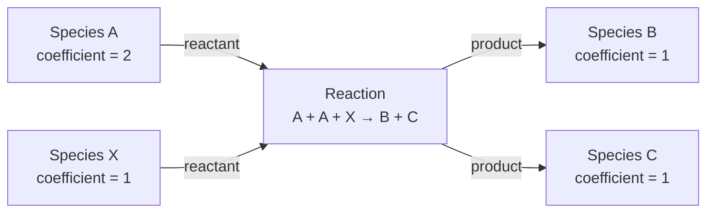

# 反应网络语义与导出

ReacNet Scope 在同一个 Dash“反应网络”工作区中展示两种不同的数据模型。
界面、payload 和导出文件都用 `network_semantics` 与 `evidence_level`
明确标记来源，避免把聚合计数解释成尚未计算的动力学量。

## 三种概念不能互换

| 概念 | 当前来源 | 表示什么 | 不表示什么 |
| --- | --- | --- | --- |
| 机制 passage 网络 | `.reactionabcd` | 观测到的反应记录、正净 passage count、完整反应两侧 | 速率常数、自由能垒、原子连续机理 |
| 事件转移观察网络 | `.lammpstrj.table` | 物种到物种的聚合观察次数 | 显式反应方程、参与原子或化学计量 |
| 动力学通量 | 未来模型 | 需要时间归一化、状态定义和动力学假设的量 | 不能直接用上述任一计数替代 |

当前机制 payload 使用：

```json
{
  "schema_version": "reacnet-scope/mechanism-network/v1",
  "network_semantics": "mechanism",
  "evidence_level": "reaction_passage_counts"
}
```

事件索引就绪并与查询快照一致时，`evidence_level` 为
`event_evidence_linked`。这表示反应节点关联了预建 SQLite 索引中的事件汇总，
并不表示反应已被实验确认。

观察网络使用：

```json
{
  "network_semantics": "event_transfer",
  "evidence_level": "aggregate_observation"
}
```

## 机制网络是物种/反应二部图

一个多反应物、多产物反应不会被压缩为若干条看似独立的 Species → Species
边。它先成为一个显式反应节点，再连接完整的反应两侧：



反应节点仍保存重复项：

```json
{
  "kind": "reaction",
  "reactants": ["A", "A", "X"],
  "products": ["B", "C"],
  "forward_tp": 12,
  "reverse_tp": 2,
  "net_tp": 10
}
```

语义边按物种聚合重复项，因此 A 到反应节点的 `coefficient` 为 `2`。
可逆记录只产生一个反应节点；两侧按正净 passage 方向归一化。净值为零的
反应不进入机制视图。

稳定 ID 由精确 SMILES、规范 reaction key 或语义边身份派生。不要用分子式
代替 SMILES 做节点匹配；同分子式的不同物种必须保持不同身份。

## 有界邻域与截断

Dash 机制网络默认查询参数为：

| 参数 | 默认值 | 含义 |
| --- | ---: | --- |
| 方向 | `both` | 同时查看锚点的上游和下游 |
| 深度 | 2 | 物种 → 反应 → 物种算一个化学步骤 |
| 最小净 TP | 1 | 排除低于阈值的正净 passage |
| 最大节点数 | 200 | 物种节点与反应节点的总上限 |

也可选择 `downstream` 或 `upstream`。遍历使用确定性广度优先顺序；候选反应
先按净 TP 降序、再按稳定 reaction key 排序。

节点上限按完整反应原子加入：如果加入一个反应节点及其尚未出现的全部参与
物种会超过 `max_nodes`，该反应整体跳过，不会留下缺少反应物或产物的半条
反应。此时：

```text
meta.truncated = true
```

截断结果是当前边界内的确定性邻域，不等于完整全局反应网络。

## 事件证据

机制图构建只读消费已经准备好的事件索引，不会在 Dash 请求中扫描
`.reactionevent.csv`、`.molecules.csv` 或构建索引。准备方式与候选路径相同：

```bash
export REACNET_SCOPE_CACHE_DIR="/data/reacnet-cache"
uv run reacnet-scope-prepare "/data/case" --event-only
```

索引缺失时，反应节点为 `network_only`，事件计数为 `null`；索引就绪时为
`evidence_linked`，并提供：

- `event_total`
- `matched_event_total`
- `event_coverage`

索引陈旧或损坏时，页面会显示人工 `--rebuild event` 命令。查询期间源文件或
索引发生变化时，不返回混合快照。

## Dash 工作流

1. 打开“高级工具 → 反应网络”。
2. 在“网络语义”选择：
   - `机制网络（reactionabcd）`
   - `观察网络（table）`
3. 机制模式下填写精确 anchor SMILES、方向、深度、最小净 TP 和最大节点数。
4. 可按 `evidence_linked` / `network_only` 过滤。过滤从已存储的原始 payload
   投影，不重新读取源文件；画布、计数和所有下载使用同一过滤后快照。
5. 选择反应节点可查看完整反应两侧、passage 与事件汇总，并把完整反应文本
   交接到事件页面。
6. “关键路径”页面选中的路径可按精确 reaction key 与 SMILES 在机制网络中
   高亮。路径来源数据集必须与当前数据集一致；切换数据集会清除旧交接状态。

页面 badge 会显示类似：

```text
mechanism · reaction passage counts
event_transfer · aggregate observation
```

## 导出格式

机制视图支持五种下载，全部来自当前 `network-store`，不会重新构建网络：

| 格式 | 返回类型 | 用途 |
| --- | --- | --- |
| Cytoscape JSON | JSON | Web/Cytoscape 互操作，保留 schema 与语义元数据 |
| GraphML | bytes | 通用图工具和 NetworkX |
| GEXF | bytes | Gephi/NetworkX；含版本化元数据 envelope |
| Node CSV | UTF-8 CSV | 节点表分析 |
| Edge CSV | UTF-8 CSV | 语义边表分析 |

Node CSV 的固定列为：

```text
id,kind,label,smiles,formula,reaction_key,reactants_json,products_json,
forward_tp,reverse_tp,net_tp,event_total,matched_event_total,event_coverage,
evidence_status
```

Edge CSV 的固定列为：

```text
id,source,target,role,species_smiles,coefficient,reaction_key
```

`reactants_json` 与 `products_json` 是紧凑 JSON 数组，保留重复化学计量项。
CSV 文本会中和电子表格公式前缀；数值（包括合法负数）仍保持数值单元格。

## Python 与 NetworkX

从机制 payload 创建 NetworkX 图：

```python
from rng_tools.mechanism_graph import (
    mechanism_graph_metrics,
    serialize_mechanism_graph,
    to_networkx_mechanism_graph,
)

graph = to_networkx_mechanism_graph(payload)
metrics = mechanism_graph_metrics(graph)

graphml_bytes = serialize_mechanism_graph(graph, format="graphml")
gexf_bytes = serialize_mechanism_graph(graph, format="gexf")
cytoscape_document = serialize_mechanism_graph(
    graph,
    format="cytoscape-json",
)
```

GraphML 重新读取：

```python
import io
import networkx as nx

restored = nx.read_graphml(io.BytesIO(graphml_bytes))
metrics = mechanism_graph_metrics(restored)
```

GEXF 重新读取：

```python
restored = nx.read_gexf(io.BytesIO(gexf_bytes))
metrics = mechanism_graph_metrics(restored)
```

GEXF 格式不能直接往返任意图级属性，因此导出器把 schema、语义、证据层级和
anchor 写入 `reacnet-scope/gexf-metadata/v1` envelope，并为每个节点写入保留的
稳定身份属性。`mechanism_graph_metrics()` 会验证并恢复这些元数据；仅有一个
看似合法的 graph name 不能绕过节点身份校验。

指标函数只使用弱连通分量、ancestors、descendants 和 degree centrality：

- `weak_component_count` / `weak_component_sizes`
- `downstream_*` / `upstream_*`
- `reachable_species_ids`
- 按稳定节点 ID 排序的 `degree_centrality`

它不运行 all-pairs 或其他超出已限定 `max_nodes` 图的昂贵算法。MultiDiGraph
中的平行边会计入 NetworkX degree centrality，因此该值可能大于 `1`，不会被
裁剪。

## 审计边界

机制图可用于定位候选反应邻域、比较 passage 强度、检查事件汇总和导出给外部
图工具。它仍不能单独证明：

- 多步路径由同一批原子连续完成；
- passage count 等于时间归一化反应速率；
- 聚合反应节点等于唯一基元反应；
- 高中心性节点必然是控制步骤。

候选路线评分与逐步事件核查见
[`pathway-analysis.md`](pathway-analysis.md)。确认机理仍需结合局部轨迹、
断键/成键、模拟条件和外部化学证据。
