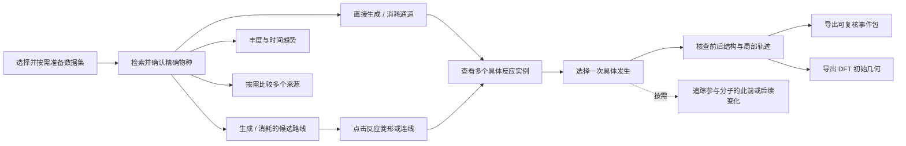

# 围绕目标物种整理使用流程

> 导航更新：普通入口现按[ADR-0029](adr/0029-open-analysis-from-species-reactions-evolution-and-events.md)分为 RNG 数据、物种、反应、演化和事件；本提案的历史工具摆放不再作为验收标准。

> 历史提案：当前研究入口与导航见[物种中心研究工作流交接](species-centered-workflow-handoff-2026-09-25.md)及[ADR-0027](adr/0027-center-dash-on-persistent-research-species.md)。本文件“仅目标需另选起点”的说明已由[ADR-0026](adr/0026-search-candidates-by-anchor-mode.md)替代，不作为现行要求。

状态：已实施；科学契约同步至设计基准和 ADR-0020。
日期：2026-09-21。
依据：当前工作区代码（含已有未提交改动）、用户提供的候选路径合并图，以及后续讨论。
用户选择以目标物种为中心；本次讨论后的方案以候选路线、逐步反应实例核查和 DFT 初始几何
交接为主线，具体分子变化追踪为可选辅助。以下内容记录已落地的使用逻辑；自动化验收与
尚待人工确认的项目见[开发计划与交付记录](target-species-workflow-development-plan.md)。

## 1. 主流程与研究对象

推荐主流程为：**选数据 → 确认目标物种的精确结构 → 探索生成/消耗路线 → 选择反应步骤 →
查看并比较具体反应实例 → 核查前后结构与局部轨迹 → 导出证据或 DFT 初始几何**。
只研究单步反应时，经直接生成/消耗通道进入实例列表即可。每一步允许独立进入，不要求用户
逐页完成向导，也不要求导出 DFT 几何才算完成分析。

目标物种是这次研究的起点，不是所有后续图中的当前节点。查看某个中间物种、共同反应物或
谱系节点，只改变详情焦点；只有显式“以此物种开始分析”才替换研究对象。原始查询与返回位置
随交接保留。这里的研究对象属于会话选择，不引入另一份 Current Dataset。

现有五工作区继续作为工具入口。日常操作主要通过当前对象旁的下一步按钮衔接，用户不必
先记住“哪种分析在哪个页面”。CLI/API 继续承担已有批处理和可复现分析，复用相同核心。

### 1.1 用户需要理解的对象层级

| 对象 | 含义 | 用户得到的信息 |
| --- | --- | --- |
| 目标物种 | 一个精确 RNG 结构身份 | 本次研究哪一种结构 |
| 候选路线 | 由已观测的有向反应与明确主线物种连接而成 | 有哪些多步路线值得研究 |
| 反应步骤 | 路线中的一次物种层面转化，保留完整反应计量 | 该步的共同反应物、产物及支持记录 |
| 具体反应实例 | 一次独立 Reaction Occurrence | 哪个时间区间、哪些具体分子和原子参与了反应 |
| 参与分子 | 实例中某一侧的一个 Molecule Instance | 核查结构、选择几何或按需追踪变化的对象 |

“具体反应实例”是 Reaction Occurrence 的界面说明，不另造一种科学身份；“参与分子”
与整次反应实例严格区分。界面使用“分子变化追踪”，技术文档和 API 保留 Molecule Lineage
等既有术语。“实例 1”等编号只作显示，引用仍使用稳定事件身份。

### 1.2 路线与连续实例的关系

候选路线可以综合不同分子的反应记录。例如 A₁→B₁ 与 B₂→C₂ 可以分别支持候选路线
A→B→C 的两个步骤，前提是每一步满足既有方向、精确身份与事件内主线原子传递要求。
发现 B₁ 后来转化为 D₁，不反驳 B→C 的独立记录，也不否定候选路线。

完整连续历史只回答“在已检查证据及约束内，是否找到具体实例依次经历这些步骤”。
未检查、约束内未找到或证据不足不降低候选资格，不作为默认过滤或排名条件，不以“路线
通过/不通过”呈现。找到实例链也不等于已确认主机理；它提供一个具体观测案例。

因此，查看各步骤的支持实例即可完成主要证据核查。跨多步的分子变化追踪和连续实例检查
保留为按需工具，不设为查看路线、核查单步或导出 DFT 几何的前置步骤。

## 2. 已落地的功能组织

| 功能 | 当前入口 | 落地方式 |
| --- | --- | --- |
| 精确结构、分子式和质量检索，物种详情 | 物种与趋势 | 选定物种后形成清晰的研究起点 |
| 丰度曲线、元素分布 | 物种与趋势内部任务 | 作为了解目标及全局背景的分支 |
| 直接生成/消耗通道、反应式检索、时间分布 | 反应与事件 | 优先呈现用户所选物种的问题 |
| 起点探索、起点到目标、路线合并图与比较 | 反应与事件中的候选路径 | 与单步通道衔接，保留独立证据含义 |
| 步骤事件、真实键图、所选路线连续历史检查 | 候选路径内部 | 优先进入单步实例；连续检查放在可选分析中 |
| 事件检索、事件选择 | 反应与事件中的具体事件 | 汇总及切换多个实例，复用前一步已选事件 |
| Molecular Lineage 展开、已展开图中的路径提取、原始帧回查 | 结构与轨迹 | 界面称“分子变化追踪”，作为所选参与分子的可选操作 |
| 局部轨迹、事件包、DFT 初始几何 | 结构与轨迹 | 承接所选反应实例的核查和结构导出 |
| 多来源丰度、反应与条件比较 | 对比 | 保留为独立分支，不改变 Current Dataset |

本轮完成的交互衔接：

1. 路径图的反应菱形和两侧连线统一定位完整反应步骤；步骤概览、支持实例和当前实例键结构
   在同一证据区展示。
2. 实例选择使用稳定 `event_id`，支持上一/下一实例跨证据页切换；同一 Transition 内的列表
   顺序不解释为发生先后。
3. “查看前后结构与轨迹”直接交接当前实例。交接前从索引重读所在证据页，结构工作区显示
   实例和来源步骤，返回时回到候选路线。
4. 实例交接会清除旧轨迹、DFT 预览和变化追踪结果。坐标缺失时保留事件与分子证据，并明确
   禁用局部轨迹；不会把无坐标误写成无实例。
5. “追踪参与分子的变化”直接展开可选面板。工作区显示名改为“结构与轨迹”，页面入口只要求
   事件检索能力，坐标和 segment 能力由具体操作分别检查。

上述交互已有 Dash HTTP/回调测试；真实数据浏览器视觉与操作验收仍需在有浏览器的发布环境完成。

## 3. 五个工作区如何组织

| 工作区 | 首要研究问题 | 建议组织 |
| --- | --- | --- |
| 数据集 | 本次分析使用什么数据，可以做什么？ | 当前数据、来源、逐项能力、准备任务；加载成功后突出“查找目标物种” |
| 物种与趋势 | 我要研究的是哪个结构，它如何变化？ | 检索 → 选定结构 → 物种概览；趋势和元素分布按需展开 |
| 反应与事件 | 它如何生成/消耗，有哪些具体记录？ | 同层任务：直接通道、候选路线、具体事件；反应式检索保留为直接入口 |
| 结构与轨迹 | 这次反应的结构如何变化，如何用于后续计算？ | 前后结构、键变化、局部轨迹、事件包与 DFT 几何；分子变化追踪按需展开 |
| 对比 | 相同研究对象在其他来源中有何差异？ | 精确对象映射、来源选择与分组确认、比较结果 |

“导出”依附当前结果，不新增空白的报告工作区；兼容的事件端点分支追踪保持折叠。
普通入口继续不推广 Path Verification、Species Fate、表观速率及扩展 QC 调度。
工作区建议更名只涉及用户文案；五工作区归属、底层接口与科学身份保持现有边界。

### 3.1 物种概览

选定结构后，首先展示结构卡、精确 RNG 标签、分子式、已有统计及能力提示。已知 `miso=1`
时说明其代表身份，具体事件的真实键状态放在证据核查中；缺失处理设置仍标为未知。

操作按“生成”和“消耗”组织：生成侧提供“查看直接生成反应 / 寻找生成路线”，消耗侧提供
“查看直接消耗反应 / 从此物种探索”。趋势是辅助入口。数据可用时显示已有趋势摘要，
不因打开详情自动运行路径搜索或索引准备。

“寻找生成路线”只把当前物种设为目标，用户还需选择精确起始物种。现有候选服务没有
“仅给目标即可反向穷举全部前体”的入口，不能用文案暗示已经支持。从此物种探索则把它设为起点。
没有已知起点时，先查看直接生成通道及其支持实例，再决定是否以某个前体继续探索；
需要了解某个具体产物的前史时，才使用可选的分子变化追踪。

### 3.2 候选路线与截图中的合并图

保留合并图作为候选结果的主要浏览视图。组织为“简洁查询区 + 图与对象详情 + 按需证据区”：

- 保留“物种 → 反应菱形 → 物种”结构；点击菱形或其两侧连线打开同一份步骤详情。
  单步原子变化作为该步骤所选实例的证据内容，跨事件的分子变化追踪作为详情内的延伸操作。
  不把整段连续历史压成候选图的一条普通边，也不因主线起止物种相同而合并不同完整反应。
- 查询区常显起点/目标、最大步数、当前折叠规则和执行状态；执行预算收进高级设置。
- 图上方保留返回路线数、查询是否完整、搜索范围与截断提示。20 条返回路线不称为全部路线。
- 点击物种显示结构及研究动作；点击步骤显示完整反应计量、主线载体、原始支持数及折叠情况。
- 当前路线只有一套选择状态，图高亮、路线切换、步骤详情和比较列表同步使用它。
- 步骤详情就地进入“反应实例”；已选实例直接“查看前后结构与轨迹”，并按需导出 DFT 初始几何。
- 现有“检查所选路线的连续历史”建议收进可选分析，文案说明为“查找连续发生的实例”。
  保留现有检查参数与结果边界，不宣称已支持无约束穷举；结果不与步骤事件数混成评分，
  未找到不显示为路线不成立。若交接其具体实例链，另行实现稳定引用适配。
- 多路线对照、逐步结构长列表及导出选项按需展开，减少同一信息在页面不同位置重复出现。

合并图中的同一 Species 可以汇合；分子变化追踪中不同时段的 segment 必须保留为不同对象。
两种图可共享点击、缩放、结构卡等交互习惯，不共享节点合并语义或默认折叠规则。

### 3.3 一个步骤的多个具体反应实例

采用“汇总展示，逐个核查”：步骤详情显示支持实例数及时间分布，下方分页列出具体发生。
同一采样区间内的 A₁+O₂₁→B₁、A₂+O₂₂→B₂ 等分别保留，不因反应式和区间相同而合并。
具体发生通过已有稳定事件身份、参与分子和原子集合区分；区间内无记录的先后不作推断。

列表显示时间区间、参与结构及可展开的原子集合、分子关联状态和坐标查看能力。选择实例后
显示完整前后反应参与者、RNG 键变化和原子对应，并提供上一个/下一个实例。切换实例只更新
该次发生的详情、轨迹和导出对象，保留研究物种、候选路线与步骤。

反应类型的总发生数、符合所选候选步骤原子传递条件的支持实例数、未解析发生数分开报告。
未解析发生仍计入对应反应统计，但不能自动当作已证实主线原子传递的支持实例，不能打开
需要精确参与分子的轨迹或 DFT 导出。同一次发生中有多个参与者选择，也不重复计成多次发生。

展示某一个实例不意味着它代表全部。首轮提供浏览、切换和人工比较，不新增“最合理实例”
自动评分；结构差异和环境差异只有在对应证据可用时才展示，不据计数推断能垒或优先机理。

### 3.4 核查结构与交接 DFT 初始几何

所选实例的主要操作为“查看前后结构”“查看局部轨迹”“导出事件包”和“导出 DFT 初始几何”。
RNG 提供反应及键变化证据，原始坐标提供空间几何；是否有坐标不决定它属于候选还是连续历史。

DFT 导出绑定同一次已匹配 occurrence：反应物来自其精确 before 帧，产物来自精确 after 帧。
不能将实例 1 的反应物和实例 2 的产物拼成同一次反应的结构对。需要已准备的轨迹索引、
完整元素映射及确认的 Å 单位，并通过既有结构完整性检查；不能用最近帧代替精确事件帧。

按侧选择完整参与分子，按既有选项导出独立分子或多分子复合物。跨周期边界的完整分子
按既有 PBC 规则重建，保留同侧多分子相对位置；导出记录事件身份、源修订、帧、选择与原子映射。
沿用 XYZ、manifest、atom map 等既有几何包。电荷和多重度可暂缺，但不得自动猜测。

多个实例可用于选择不同构象或反应取向的初始几何。首轮逐实例导出，不承诺批量构象筛选、
任意环境截断或量化作业生成；轨迹中可看的周围环境不自动成为 DFT 导出范围。
导出的是未优化初始结构，不是过渡态、已验证机理或完整计算任务。

### 3.5 可选的分子变化追踪

用户需要解释某个参与分子的来源、后续变化或原子去向时，从该反应实例选择具体参与分子，
点击“追踪这个分子的变化”。它不阻断当前实例的结构核查或导出，也不强制覆盖完整候选路线。

从目标物种的生成事件进入时，优先提示产物侧匹配的实例；从消耗事件进入时提示反应物侧。
同一侧存在多个同 Species 参与者时必须展示各自原子集合供选择，不能把物种身份当成实例。
未解析 occurrence 保留统计和限制说明，不提供无法履行的分子追踪入口。

界面使用“变化关系图 / 单条变化历史”两个视图，分别展示全部已展开分支和其中一条连续投影；
领域含义仍分别为 Molecular Lineage Graph 与 Event Path，不改科学模型或导出名称。
按钮使用“向过去展开”“向后续展开”“展开后续分支”“查看此事件”“查看此帧”等明确动作。
界面主文案采用中文；Segment、Occurrence 等原始术语及身份放在详情中。

当前路径提取服务从根实例到所选 segment 按时间向前提取。向过去浏览谱系不等于已经支持
任意方向的路径提取；需要研究早期实例到当前实例的路径时，应显式从早期实例重新开始。
提供快捷重设起点需要保留返回上下文，并明确它会改变根实例和锚点参照。

没有坐标时，若事件和 segment 证据已就绪，基本谱系仍可使用。元素锚点所需映射、精确帧
坐标和 DFT 几何分别检查自己的依赖。保留全部分裂/合并参与者、锚点连续性、返回与外来原子
的独立事实，不因界面简化改变 ADR-0018/0019 的语义。

## 4. 跨页面规则

### 对象与返回

全局始终显示 Current Dataset 和研究物种。对象摘要按实际经过的操作形成，例如：

> 目标物种 → 候选路线 3 → 步骤 2 → 事件 → 产物实例

路线序号仅用于显示。交接依次使用精确 Species、完整有向 Reaction Type、Candidate
signature、Occurrence Identity、参与侧与实例引用，并携带 Dataset Identity、源修订与
请求身份。接收页面重新解析和核验对象，不信任旧表格行号或参与者下拉序号作为独立身份。

返回上一结果恢复原查询、路线、步骤、勾选和浏览位置，不自动重跑。源修订变化则先提示
旧结果失效；切换数据集清空所有绑定旧来源的选择与结果。正在准备的任务仍归属原数据集。
统一交接行为可沿用现有 stores，实施时无需先重写全部状态管理。

### 能力与时间范围

能力提示按操作呈现，例如“可查反应实例；局部坐标缺失；分子变化追踪需准备”。进入工作区本身不
触发重型准备。需要准备时跳到数据集中的相应任务，并保留返回位置；完成后由用户继续分析。

不设置一个看似作用于所有分析的全局时间筛选。趋势、通道时间分布、候选搜索和具体谱系
的范围不同：每个结果显示其实际采用的范围，只有目标服务支持时才交接筛选条件。
现有候选查询使用当前发布索引及自身搜索约束，不能因之前查看了某段趋势就称已按该时间窗筛选。
物理时间未知时保留分析帧/source timestep/Transition，不猜测 ps。

### 证据表述与导出

| 当前对象 | 可以说明 | 必须保留的边界 |
| --- | --- | --- |
| 直接通道 / 候选步骤 | 相应方向及单步支持记录 | 单步计数不是整条路线发生次数 |
| 候选路线 | 在所选约束内找到的网络路线 | 不同步骤不必来自同一分子历史 |
| 连续历史检查（可选） | 所选路线的检查状态与具体连续性事实 | 未检查、找到实例链、约束内未找到、证据不足分别显示，不作为路线有效性判据 |
| 谱系 / 已观测路径 | 已展开范围内的实例联系与连续锚点投影 | 未展开不等于不存在，原子返回不恢复全程连续 |
| 坐标与初始几何 | 指定事件/精确帧的几何信息 | 不作为第二套反应证据或已优化机理 |

导出按钮明确当前范围：候选路线 JSON/逐步 CSV、步骤事件、当前谱系 JSON、事件包或 DFT
初始几何。沿用已有格式与来源信息；本轮整理不新增未经定义的综合报告或统一科学结果 schema。
部分查询结果保留截断、未解析和范围信息。JSON 不能在展示层被改成更强的科学结论。

## 5. 实施顺序与验收

实施顺序以[当前开发计划](target-species-workflow-development-plan.md)为准：固定基线 →
图中步骤与实例详情 → 所选实例的结构交接与返回 → DFT/事件证据导出 → 可选变化追踪与
导航整理 → 全流程验收。先打通图上的研究主线，再整理外围入口。

首个主线交付点是“图 → 步骤 → 多实例 → 结构 → 导出”走通并通过对应验收；可选变化追踪
不作为该版本前置条件。下面保留本方案的研究场景清单，具体代码范围和测试安排不在此重复维护。

各阶段复用现有分析服务。跨模块交互实施后按
[验证指南](agents/testing.md) 跑受影响测试及要求的全量检查，并做浏览器操作验收。
至少覆盖以下研究场景：

1. 分子式匹配多个结构 → 显式选择一个 → 候选路线或直接生成通道 → 支持实例 → 结构核查。
2. 已选目标物种 → 补选起点 → 候选路线 → 步骤 → 已选实例 → 返回同一路线和步骤。
3. 当前物种作起点探索 → 搜索截断 → 图和导出均保留不完整状态。
4. 无坐标但 segment 索引可用 → 可以展开基本谱系；坐标功能说明缺失原因。
5. 同 Species 有多个参与实例 → 显式选中其一；同 Species 在不同时段重现不合并 segment。
6. 核查过程中切换数据集或收到迟到响应 → 旧结果不能覆盖新上下文。
7. 查看局部时间窗后进入候选分析 → 明示候选实际范围；不继承未支持的过滤。
8. 从研究物种进入多来源比较 → 精确身份可核验，Current Dataset 保持原值。
9. 同一反应在同一区间发生多次 → 实例独立、可切换，当前 DFT 导出跟随所选稳定事件身份。
10. 聚合计数含未解析发生 → 总数与已解析/候选支持数分别说明，未解析项不产生虚构结构。
11. 各步骤有支持但未找到整条连续实例 → 路线保留，各步核查和 DFT 导出仍可进行。
12. 导出某次发生的前后几何 → 精确帧、完整分子、元素及单位检查通过；产物不得来自另一实例。

本方案的主线交互和自动化回归已经落地。小型 fixture 与 HTTP/回调测试不证明大型真实数据
性能或跨平台视觉表现；浏览器人工操作、真实数据端到端导出和 macOS/Windows 验收仍单独记录。

## 6. 依据

- [当前使用说明](usage-logic-redesign.md)
- [设计基准：核心链路、工作区及分析契约](software-design-baseline.md)
- [ADR-0014：五工作区](adr/0014-converge-dash-around-five-workspaces.md)
- [ADR-0015：候选路径任务](adr/0015-add-indexed-candidate-task-to-reaction-workspace.md)
- [ADR-0017：往返证据与连续历史检查](adr/0017-qualify-candidate-events-and-check-selected-history.md)
- [ADR-0018：具体分子谱系](adr/0018-explore-segment-occurrence-lineage.md)
- [ADR-0019：锚点连续性与原子来源](adr/0019-separate-anchor-continuity-and-atom-provenance.md)
- [ADR-0020：以候选步骤和具体实例组织 Dash 主线](adr/0020-center-dash-on-candidate-step-occurrences.md)

ADR-0020 只替代 ADR-0018 的产品入口优先级；segment、锚点连续性、原子来源和导出语义
仍按 ADR-0018/0019 执行。
